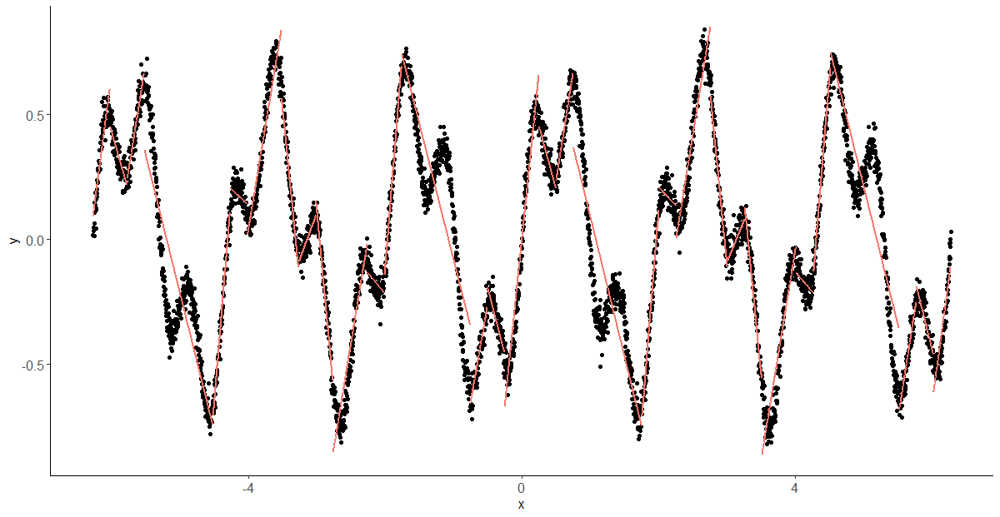
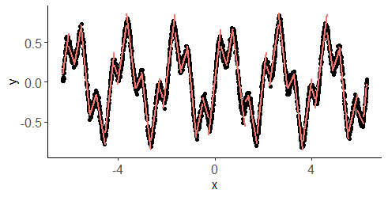

Purpose
-------

Estimate nonlinear correlations using `nlcor`. Yields a correlation
estimate between 0 and 1, and the adjusted p value. The p value
indicates if the estimated correlation is statistically significant.

Description
-----------

Correlations are commonly used in various data mining applications.
Typically linear correlations are estimated. However, the data may have
a nonlinear correlation but little to no linear correlation. If, for
example, we are performing data exploration using automated techniques
on many variables, such nonlinearly correlated variables can easily be
overlooked.

Nonlinear correlations are quite common in real data. Due to this,
nonlinear models, such as SVM, are employed for regression,
classification, etc. However, there are not many approaches to estimate
nonlinear correlations. If developed, it will find application in data
exploration, variable selection, and other areas.

In this package, we provide an implementation of a nonlinear correlation
estimation method using an adaptive local linear correlation computation
in `nlcor`. The function `nlcor` returns the nonlinear correlation
estimate, the corresponding adjusted p value, and an optional plot
visualizing the nonlinear relationships.

The correlation estimate will be between 0 and 1. The higher the value
the more is the nonlinear correlation. Unlike linear correlations, a
negative value is not valid here. Due to multiple local correlation
computations, the net p value of the correlation estimate is adjusted
(to avoid false positives). The plot visualizes the local linear
correlations.

In the following, we will show its usage with a few examples. In the
given examples, the linear correlations between `x` and `y` is small,
however, there is a visible nonlinear correlation between them. This
package contains the data for these examples and can be used for testing
the package.

### Example 1.

A data with cyclic nonlinear correlation.

    plot(x1, y1)

The linear correlation of the data is,

    cor(x1, y1)
    #> [1] 0.008001837

As expected, the correlation is close to zero. We estimate the nonlinear
correlation using `nlcor`.

    c <- nlcor(x1, y1, plt = T)
    c$cor.estimate
    #> [1] 0.8688784
    c$adjusted.p.value
    #> [1] 4.306386e-44
    print(c$cor.plot)

The plot shows the piecewise linear correlations present in the data.

### Example 2.

A data with non-uniform piecewise linear correlations.

    plot(x2, y2)

The linear correlation of the data is,

    cor(x2, y2)
    #> [1] 0.828596

The linear correlation is quite high in this data. However, there is
significant and higher nonlinear correlation present in the data. This
data emulates the scenario where the correlation changes its direction
after a point. Sometimes that change point is in the middle causing the
linear correlation to be close to zero. Here we show an example when the
change point is off center to show that the implementation works in
non-uniform cases.

We estimate the nonlinear correlation using `nlcor`.

    c <- nlcor(x2, y2, plt = T)
    c$cor.estimate
    #> [1] 0.897205
    c$adjusted.p.value
    #> [1] 6.981938e-49
    print(c$cor.plot)

It is visible from the plot that `nlcor` could estimate the piecewise
correlations in a non-uniform scenario. Also, the nonlinear correlation
comes out to be higher than the linear correlation.

### Example 3.

A data with higher and multiple frequency variations.

    plot(x3, y3)

The linear correlation of the data is,

    cor(x3, y3)
    #> [1] -0.1337304

The linear correlation is expectedly small, albeit not close to zero due
to some linearity.

Here we show we can refine the granularity of the correlation
computation.

Under default settings, the output of `nlcor` will be,

    c <- nlcor(x3, y3, plt = T)
    c$cor.estimate
    #> [1] 0.7090148
    c$adjusted.p.value
    #> [1] 1.204281e-37
    print(c$cor.plot)

As can be seen in the figure, `nlcor` overlooked some of the local
relationships. We can refine the correlation estimation by changing the
`refine` parameter. The default value of `refine` is set as 0.5. It can
be set as any value between `0` and `1`. A higher value enforces higher
refinement. However, higher refinement adversely affects the p value.
Meaning, the resultant correlation estimate may be statistically
insignificant (similar to overfitting). Therefore, it is recommended to
avoid over refinement.

In this data, we rerun the correlation estimation with `refine = 0.9`.

    c <- nlcor(x3, y3, refine = 0.9, plt = T)
    c$cor.estimate
    #> [1] 0.8534956
    c$adjusted.p.value
    #> [1] 2.531456e-06
    print(c$cor.plot)
    #> Warning: Removed 148 rows containing missing values (geom_path).

As can be seen in the figure, `nlcor` could identify the granular
piecewise correlations. In this data, the p value still remains
extremely small—the correlation is *statistically significant*.

Summary
-------

This package provides an implementation of an efficient heuristic to
compute the nonlinear correlations between numeric vectors. The
heuristic works by adaptively identifying multiple local regions of
linear correlations to estimate the overall nonlinear correlation. Its
usages are demonstrated here with few examples.

------------------------------------------------------------------------

Support
-------

Chitta Ranjan <cranjan@processminer.com>

Vahab Najari <vnajari@processminer.com>

Visit &lt;www.processminer.com&gt; for further information.
